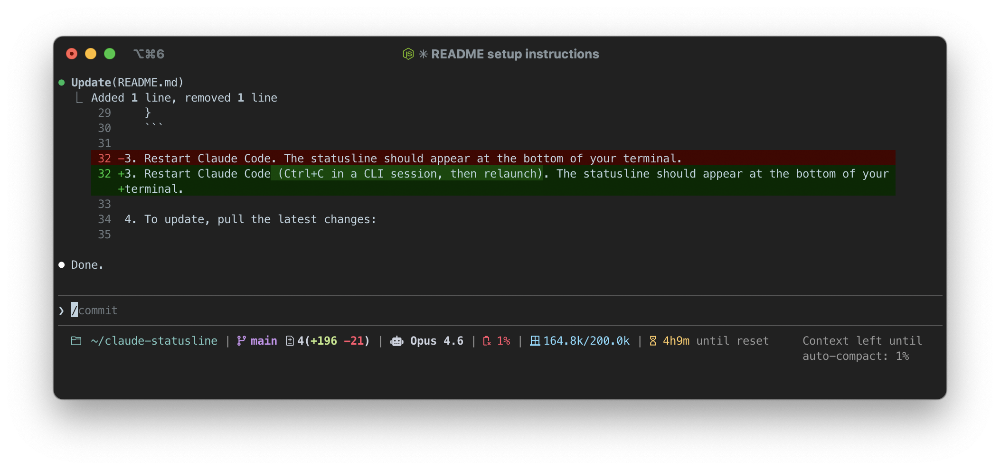

# Claude Code Statusline

A configurable statusline script for [Claude Code](https://claude.ai/code) that displays git status, context window usage, session cost, daily stats, and session reset timers in your terminal.




## Prerequisites

- **bash** and **jq** (used to parse JSON input from Claude Code)
- **A Nerd Font** (optional) — icons use [Nerd Font](https://www.nerdfonts.com/) glyphs by default. If you don't have one installed, set `CLAUDE_STATUSLINE_ICONS=0` to use ASCII fallbacks (see [Disabling Icons](#disabling-icons) below).

## Installation

1. Clone the repo and make the script executable:

   ```bash
   git clone https://github.com/whitslar/claude-statusline.git ~/claude-statusline
   chmod +x ~/claude-statusline/statusline.sh
   ```

2. Configure Claude Code to use it. Open (or create) your settings file at `~/.claude/settings.json` and add:

   ```json
   {
     "statusLine": {
       "type": "command",
       "command": "~/claude-statusline/statusline.sh"
     }
   }
   ```

3. Restart Claude Code (Ctrl+C in a Claude Code CLI session). The statusline should appear at the bottom of your terminal.

4. To update, pull the latest changes:

   ```bash
   git -C ~/claude-statusline pull
   ```

## Disabling Icons

If you don't have a Nerd Font installed, the default icons will render as missing-glyph boxes. Disable them by prepending the environment variable to the command in your `settings.json`:

```json
{
  "statusLine": {
    "type": "command",
    "command": "CLAUDE_STATUSLINE_ICONS=0 ~/claude-statusline/statusline.sh"
  }
}
```

This switches all icons to plain ASCII characters (e.g., `^`/`v` for ahead/behind, `S` for staged, `M` for modified, `[====]` for battery).

## Configuration

All options are set via environment variables, prepended to the command in `settings.json`. Set any combination by separating them with spaces:

```json
{
  "statusLine": {
    "type": "command",
    "command": "CLAUDE_STATUSLINE_ICONS=0 CLAUDE_STATUSLINE_COST=\"total_usd,duration\" CLAUDE_STATUSLINE_DAILY=\"messages,sessions\" ~/claude-statusline/statusline.sh"
  }
}
```

### Environment Variables

| Variable | Default | Description |
|---|---|---|
| `CLAUDE_STATUSLINE_COLORS` | `1` | `1` = ANSI colors enabled, `0` = plain text |
| `CLAUDE_STATUSLINE_ICONS` | `1` | `1` = Nerd Font icons, `0` = ASCII fallbacks |
| `CLAUDE_STATUSLINE_VERBOSE` | `1` | `1` = show labels like "left", "until compact", `0` = hide |
| `CLAUDE_STATUSLINE_GIT` | `branch,ahead_behind,staged,modified,add_remove,stash` | Comma-separated list or `0` to disable. Options: `branch`, `ahead_behind`, `staged`, `modified`, `untracked`, `stash`, `dirty`, `hash`, `add_remove` |
| `CLAUDE_STATUSLINE_CONTEXT_USAGE` | `tokens_fraction` | Comma-separated list or `0`. Options: `battery_icon`, `pct_remaining`, `pct_used`, `tokens_fraction`, `tokens_remaining`, `tokens_until_autocompact`, `tokens_used`, `context_size` |
| `CLAUDE_STATUSLINE_CONTEXT_REMAINING` | `battery_icon,pct_remaining` | Comma-separated list or `0`. Options: `battery_icon`, `pct_remaining`, `tokens_remaining`, `tokens_fraction` |
| `CLAUDE_STATUSLINE_CONTEXT_REMAINING_USE_AUTOCOMPACT` | `1` | `1` = subtract autocompact buffer from remaining context, `0` = raw values |
| `CLAUDE_STATUSLINE_AUTOCOMPACT_BUFFER` | auto-detected | Override auto-detected autocompact buffer (tokens). Set to `0` to disable buffer adjustment |
| `CLAUDE_STATUSLINE_COST` | `1` | Comma-separated list or `0`. Options: `total_usd`, `duration`, `lines_added`, `lines_removed`, `lines_changed` |
| `CLAUDE_STATUSLINE_DAILY` | `0` (disabled) | Comma-separated list or `0`. Options: `messages`, `sessions`, `tokens`, `tools`. Reads from `~/.claude/stats-cache.json` |
| `CLAUDE_STATUSLINE_SESSION` | `1` | `1` = show session reset countdown timer, `0` = hide |
| `CLAUDE_STATUSLINE_DEBUG` | `0` | `1` = show raw JSON input and session timing debug info |

### Cache TTLs

| Variable | Default | Description |
|---|---|---|
| `CLAUDE_STATUSLINE_GIT_CACHE_TTL` | `5` | Git data cache lifetime in seconds |
| `CLAUDE_STATUSLINE_DAILY_CACHE_TTL` | `60` | Daily stats cache lifetime in seconds |
| `CLAUDE_STATUSLINE_SESSION_CACHE_TTL` | `30` | Session stats cache lifetime in seconds |

## Autocompact Buffer

The `CONTEXT_REMAINING` section can account for Claude Code's autocompact threshold — the point at which context is automatically compacted, not the absolute end of the context window. This gives you a more accurate picture of how much usable context you have left before a compaction happens.

### Auto-detection (per model)

The script automatically detects the autocompact buffer **per model** by parsing `/context` output logged in `~/.claude/projects/*.jsonl`. It extracts both the model ID (e.g., `claude-opus-4-6`) and buffer size from each `/context` entry, and stores the results in `~/.claude/autobuffer-sizes.json`:

```json
{
  "claude-opus-4-6": 33000,
  "claude-opus-4-5-20251101": 45000,
  "claude-haiku-4-5-20251001": 45000
}
```

For auto-detection to work, run `/context` at least once per model in Claude Code. The script scans at most once per hour and caches results persistently — after the first detection, lookups are instant.

If the buffer size for the current model hasn't been detected yet, the statusline will display:

```
Autocompact buffer size not found. Run /context once in Claude Code to auto-detect it, or set CLAUDE_STATUSLINE_AUTOCOMPACT_BUFFER.
```

### Manual override

Set `CLAUDE_STATUSLINE_AUTOCOMPACT_BUFFER` to skip auto-detection and use a fixed value for all models:

```json
"command": "CLAUDE_STATUSLINE_AUTOCOMPACT_BUFFER=33000 ~/claude-statusline/statusline.sh"
```

Set to `0` to disable the buffer adjustment entirely (percentages and token counts will reflect the raw context window, and the "not found" error is suppressed):

```json
"command": "CLAUDE_STATUSLINE_AUTOCOMPACT_BUFFER=0 ~/claude-statusline/statusline.sh"
```

The buffer only affects the `CONTEXT_REMAINING` section when `CLAUDE_STATUSLINE_CONTEXT_REMAINING_USE_AUTOCOMPACT=1` (the default). It does not affect `CONTEXT_USAGE`.

### Debugging

Enable debug mode (`CLAUDE_STATUSLINE_DEBUG=1`) to see the resolved model ID and buffer value:

```
Model ID: claude-opus-4-6 | Autocompact buffer: 33000 tokens
```

## Example Configurations

**Minimal (no icons, context only):**
```json
"command": "CLAUDE_STATUSLINE_ICONS=0 CLAUDE_STATUSLINE_GIT=0 CLAUDE_STATUSLINE_CONTEXT_USAGE=pct_remaining ~/claude-statusline/statusline.sh"
```

**Full monitoring:**
```json
"command": "CLAUDE_STATUSLINE_CONTEXT_USAGE=\"battery_icon,pct_remaining\" CLAUDE_STATUSLINE_COST=\"total_usd,lines_changed\" CLAUDE_STATUSLINE_DAILY=\"messages,sessions\" ~/claude-statusline/statusline.sh"
```

**Developer focus (git + compact context):**
```json
"command": "CLAUDE_STATUSLINE_GIT=\"branch,dirty,add_remove\" CLAUDE_STATUSLINE_CONTEXT_USAGE=battery_icon ~/claude-statusline/statusline.sh"
```

## Testing

Run the visual test matrix to preview all option combinations:

```bash
./statusline-test.sh
```

Or test manually with sample JSON:

```bash
echo '{"model":{"id":"claude-opus-4-6","display_name":"Opus 4.6"},"workspace":{"current_dir":"/tmp/test"},"context_window":{"used_percentage":42,"remaining_percentage":58,"total_input_tokens":85000,"total_output_tokens":12000,"context_window_size":200000},"cost":{"total_cost_usd":0.42,"total_duration_ms":135000,"total_lines_added":156,"total_lines_removed":23}}' | ./statusline.sh
```
